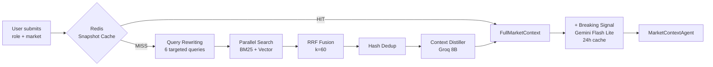
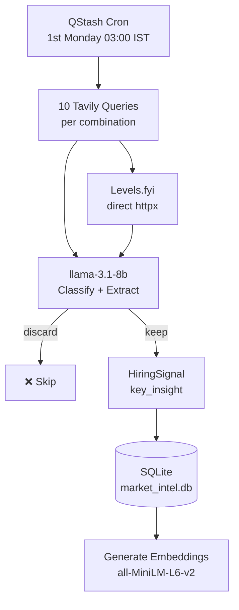
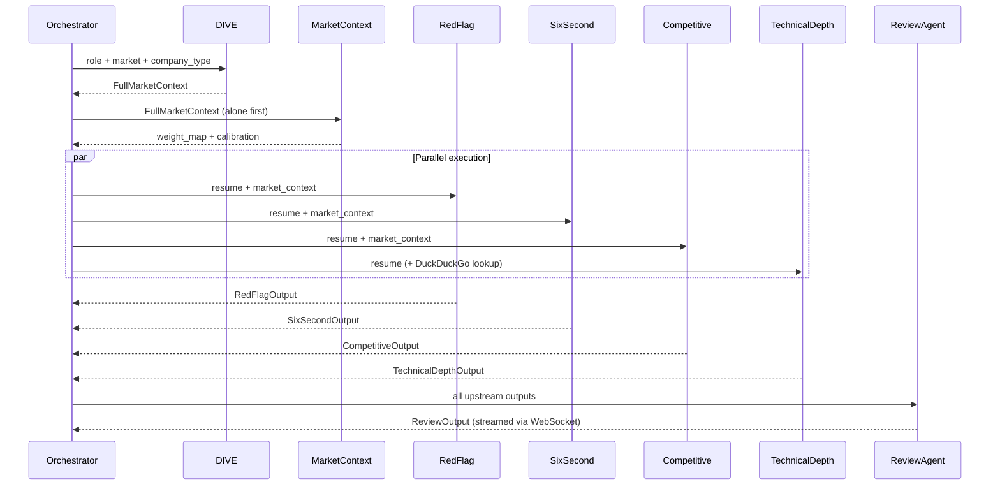

<div align="center">

# 🔥 ROAST
### Resume Intelligence System

**[🌐 Live Demo →](https://roast.dev)** &nbsp;·&nbsp; **[📹 Video Demo →](#)** *(coming soon)*

> Drop your resume. Get destroyed. Get better.

[](https://python.org)
[](https://fastapi.tiangolo.com)
[](https://react.dev)
[](LICENSE)
[](https://github.com)

</div>

---

## What is ROAST?

Most resume tools read your resume and say *"add more keywords."*

ROAST does something different. It pulls **live market intelligence for your exact role and city before reading your resume** — then runs six specialised agents to produce a brutally honest, market-calibrated review. Not generic advice. Not keyword stuffing. The actual thought process a recruiter runs when they read your resume, calibrated against what's being hired for *this week*.

**What no other tool does:**
- Live job posting data from Naukri, Wellfound, Reddit, Levels.fyi — scraped monthly, not training data
- `TechnicalDepthAgent` that actually understands what you built — evaluates projects technically, not just by keyword
- Inference chains on every weakness: *what the recruiter sees → what they assume → what they decide*
- Competitive positioning against real applicants at your experience level, not senior engineers
- $0/month infrastructure — entirely on free tiers

---

## Demo

<!-- Add screenshot or GIF here -->
> 📸 *Screenshot placeholder — add after deployment*

```
BOTTOM LINE
────────────────────────────────────────────────────
Shortlist chance:   Strong for early-stage AI startups. Top 20% among freshers.
Biggest blocker:    No deployment evidence with real users or metrics.
Fix first:          Add "X analyses run" to ROAST bullet. That's the difference
                    between a project and a product.
────────────────────────────────────────────────────
```

---

## Architecture

### High-Level Flow

```mermaid
flowchart TD
    A[User uploads PDF] --> B[/analyse endpoint]
    B --> C{Validate PDF\nRate limit\nBot detection}
    C --> D[DIVE Retrieval Pipeline]
    D --> E[(SQLite\nFTS5 + sqlite-vec)]
    D --> F[Redis Snapshot Cache]
    E --> G[MarketContextAgent]
    G --> H{Parallel Agents}
    H --> I[RedFlagAgent\nGemini Flash Lite]
    H --> J[SixSecondAgent\nGroq 8B]
    H --> K[CompetitiveAgent\nGroq 8B]
    H --> L[TechnicalDepthAgent\nGroq 8B + DuckDuckGo]
    I & J & K & L --> M[ReviewAgent\nllama-4-scout primary]
    M --> N[WebSocket Stream]
    N --> O[Results Page]
```

### DIVE Retrieval Pipeline

The core innovation — market intelligence is **prebuilt offline**, not fetched at runtime.



### Monthly Ingestion Pipeline



### Agent Pipeline



---

## What Makes It Different

### TechnicalDepthAgent
A new agent that evaluates your projects with genuine technical understanding — not keyword matching. It uses DuckDuckGo search in real time to look up unfamiliar technologies (Bayesian NBV, d-vector speaker verification, RRF fusion) before evaluating them.

```
[ADVANCED] ACARE — Autonomous Clinical Assistance Robot
  Proves: 10-state FSM coordinating voice/vision/motion/safety on ROS2.
          Dual biometric auth (d-vector + face embedding). ESTOP <200ms.
          This is robotics + safety engineering + AI. Rare for a fresher.
  Strongest signal: Always-on ESTOP keyword thread with <200ms voice-to-halt
  Resume vs reality: UNDERSELLING — the safety architecture depth is buried
```

### Inference Chains
Every weakness comes with the recruiter's actual thought process:

```
"Every bullet reads as a responsibility, not an achievement.
A Zepto SDE2 hiring manager reads this and thinks: this person maintained
things, they did not build things. At SDE2 I need someone who owned outcomes.
Moving to next resume."
```

### Live Market Intelligence
Not training data. Actual job postings scraped this month.

```
Naukri: 20,880 AI Engineer openings in Bengaluru
Top required: LangChain, RAG, LLM fine-tuning, HuggingFace, FastAPI
Salary band: ₹15-30L base for freshers with production experience
```

---

## Tech Stack

### Backend
| Component | Technology | Why |
|---|---|---|
| API Framework | FastAPI + uvicorn | Async, fast, WebSocket support |
| Market Intelligence DB | SQLite + FTS5 + sqlite-vec | BM25 + vector search, no external DB |
| Session / Cache | Upstash Redis | Cloud-hosted, survives restarts |
| PDF Parsing | PyMuPDF + pdfplumber | Dual parser, annotation-layer link extraction |
| Embeddings | sentence-transformers (all-MiniLM-L6-v2) | Local, no API cost, 384 dims |
| Scheduling | Upstash QStash | Monthly cron, HMAC-verified |

### LLM Routing
| Agent | Model | Provider | Why |
|---|---|---|---|
| MarketContextAgent | llama-3.1-8b-instant | Groq | 14,400 RPD, fast synthesis |
| RedFlagAgent | gemini-3.1-flash-lite | Gemini API | Strong structured output, 500 RPD |
| SixSecondAgent | llama-3.1-8b-instant | Groq | Fast, sufficient |
| CompetitiveAgent | llama-3.1-8b-instant | Groq | Fast, sufficient |
| TechnicalDepthAgent | llama-3.1-8b-instant | Groq | Fast + DuckDuckGo search |
| ReviewAgent (primary) | llama-4-scout-17b | Groq | Best quality at 1K RPD |
| ReviewAgent (fallback A) | llama-3.3-70b-versatile | Groq | 1K RPD |
| ReviewAgent (fallback B) | qwen/qwen3-32b | Groq | 1K RPD, 60 RPM |
| ReviewAgent (fallback C) | gpt-oss-120b | Groq | Frontier class, 1K RPD |
| ReviewAgent (fallback D) | gemma-4-26b | Gemini API | 1.5K RPD, unlimited TPM |

### Data Sources
| Source | Method | What it gives |
|---|---|---|
| Naukri.com | Tavily Deep (site:naukri.com) | Active job postings, required skills |
| Reddit (r/indiancscareer) | Tavily Deep (site:reddit.com) | Real offer data, sentiment |
| Levels.fyi | Direct httpx | Verified salary data |
| LinkedIn posts | Tavily Deep (site:linkedin.com) | Hiring announcements |
| TeamBlind | Tavily Deep (site:teamblind.com) | Compensation discussions |
| LeetCode Discuss | Tavily Deep (site:leetcode.com) | Interview experiences |

### Frontend
| Component | Technology |
|---|---|
| Framework | React 19 + Vite |
| Styling | Tailwind CSS v4 |
| Animations | Framer Motion |
| Icons | Lucide React |
| Real-time | WebSocket with polling fallback |

---

## Project Structure

```
roast/
├── backend/
│   ├── agents/
│   │   ├── prompts/          # Versioned prompts per agent
│   │   ├── market_context_agent.py
│   │   ├── red_flag_agent.py
│   │   ├── six_second_agent.py
│   │   ├── competitive_agent.py
│   │   ├── technical_depth_agent.py  # New — genuine technical evaluation
│   │   ├── review_agent.py
│   │   ├── followup_agent.py
│   │   ├── tech_search.py    # DuckDuckGo real-time tech lookup
│   │   └── schemas.py
│   ├── llm/
│   │   ├── groq_client.py    # Key rotation + RPD tracking
│   │   ├── gemini_client.py
│   │   ├── openrouter_client.py
│   │   ├── circuit_breaker.py
│   │   └── router.py         # Fallback chain
│   ├── pipeline/
│   │   └── orchestrator.py   # Full pipeline coordination
│   ├── retrieval/
│   │   └── dive.py           # DIVE: BM25 + vector + RRF + dedup + distil
│   ├── routes/
│   │   ├── analyse.py        # POST /analyse
│   │   ├── session.py        # POST /session-init
│   │   ├── websocket.py      # WS /ws/{id}, GET /session/{id}/state
│   │   ├── followup.py       # POST /followup
│   │   ├── cron.py           # POST /refresh-market-intel
│   │   └── token_feedback.py # POST /token, POST /feedback
│   ├── storage/
│   │   ├── redis_client.py
│   │   ├── rate_limit.py
│   │   └── session_store.py
│   ├── corpus/
│   │   ├── corpus_store.py   # Anonymised signal storage
│   │   └── bullet_curator.py # Bullet curation pipeline
│   └── main.py
├── ingestion/
│   ├── pipeline.py           # Monthly ingestion orchestrator
│   ├── extractor.py          # Classify + extract in one Groq call
│   ├── embeddings.py         # sentence-transformers
│   ├── search.py             # BM25 search functions
│   ├── database.py           # SQLite schema + FTS5 + triggers
│   ├── tavily_client.py      # Two keys, budget tracking
│   ├── levels_scraper.py     # Direct httpx scraper
│   └── breaking_signal.py    # Daily breaking signal layer
├── frontend/
│   └── src/
│       ├── components/       # React components
│       ├── hooks/            # useWebSocket, useInferenceToggle
│       └── lib/api.js        # All API calls
└── scripts/
    └── prepopulate.py        # Pre-populate SQLite before launch
```

---

## Key Engineering Decisions

| Decision | Choice | Rationale |
|---|---|---|
| Vector DB | SQLite + sqlite-vec | Qdrant suspends after 7 days inactivity on free tier |
| Search | BM25 + vector + RRF | Neither alone is sufficient; RRF merges without score normalisation |
| Reranking | Hash dedup | MMR is O(N²); hash dedup is sufficient for duplicate removal |
| Scheduling | Upstash QStash | Talks directly to running server; no CI/CD setup needed |
| LLM routing | Custom fallback chain | 5 providers, circuit breakers, proactive switch at <50 RPM remaining |
| Ingestion LLM | llama-3.1-8b-instant | Merged classify+extract = 1 call; 30 RPM, no thinking mode overhead |
| Session state | Upstash Redis | Survives container restarts; WebSocket reconnection via polling |
| PDF parsing | PyMuPDF + pdfplumber | Dual parser; annotation-layer link extraction for LinkedIn/GitHub |

---

## Running Locally

### Prerequisites
- Python 3.12+
- Node.js 20+
- [uv](https://docs.astral.sh/uv/) package manager

### Backend

```bash
# Clone
git clone https://github.com/YOUR_USERNAME/roast.git
cd roast

# Install dependencies
uv sync

# Copy env template and fill in your keys
cp .env.example .env

# Pre-populate market intelligence (takes ~10 minutes)
uv run python3 scripts/prepopulate.py

# Start backend
uv run uvicorn backend.main:app --reload --port 8000
```

### Frontend

```bash
cd frontend
npm install
npm run dev
```

Open `http://localhost:5173`

### Environment Variables

```bash
# LLM Providers (comma-separated for key rotation)
GROQ_API_KEYS=your_groq_key
GEMINI_API_KEYS=your_gemini_key
OPENROUTER_API_KEY=your_openrouter_key

# Search
TAVILY_API_KEY_DEEP=your_tavily_key_1
TAVILY_API_KEY_GENERAL=your_tavily_key_2

# Storage
UPSTASH_REDIS_REST_URL=your_upstash_url
UPSTASH_REDIS_REST_TOKEN=your_upstash_token

# Scheduling
QSTASH_TOKEN=your_qstash_token
QSTASH_SIGNING_KEY=your_qstash_signing_key

# Email
RESEND_API_KEY=your_resend_key

# Observability
LANGFUSE_PUBLIC_KEY=your_langfuse_public_key
LANGFUSE_SECRET_KEY=your_langfuse_secret_key

# Security
HMAC_SECRET=your_hmac_secret
```

---

## Supported Roles & Markets

**Roles:** SDE1, SDE2, Senior SDE, Full Stack Engineer, Backend Engineer, Embedded Systems Engineer, VLSI Design Engineer, Data Analyst, Data Scientist, Data Engineer, ML Engineer, AI Engineer, ML/AI Engineer (2+ years), DevOps/SRE, Product Manager, Business Analyst

**Markets:** India, USA, UAE, Singapore, UK

**Company Types:** Indian Product Company (Tier 1 & 2), Indian Service Company, FAANG/Big Tech, Early Stage Startup, Growth Stage Startup, Consulting/IB, Semiconductor/Hardware, MNC India (Non-FAANG)

---

## API Reference

| Method | Route | Description |
|---|---|---|
| `POST` | `/session-init` | Create session, returns `session_id` |
| `POST` | `/analyse` | Submit resume, launches pipeline |
| `WS` | `/ws/{session_id}` | Real-time progress streaming |
| `GET` | `/session/{id}/state` | Session recovery for reconnection |
| `GET` | `/share/{session_id}` | Public TL;DR share preview |
| `POST` | `/followup` | FollowUpAgent — one per section per session |
| `POST` | `/feedback` | Useful/not useful vote |
| `POST` | `/token` | Request third-analysis email token |
| `POST` | `/refresh-market-intel` | QStash cron trigger (HMAC verified) |
| `GET` | `/health` | Liveness check |

---

## Infrastructure Cost

| Service | Usage | Cost |
|---|---|---|
| DigitalOcean Droplet | Backend hosting | $0 (GitHub Education $200 credit) |
| Vercel | Frontend hosting | $0 (free tier) |
| Upstash Redis | Session + cache | $0 (free tier, 500K commands/month) |
| Upstash QStash | Monthly cron | $0 (free tier) |
| Groq | LLM inference | $0 (free tier) |
| Gemini API | RedFlagAgent + ingestion | $0 (free tier) |
| Tavily | Web search (2 keys) | $0 (free tier, 2K searches/month) |
| Resend | Email tokens | $0 (free tier, 3K emails/month) |
| **Total** | | **$0/month** |

---

## Built By

**Sarvesh Bhattacharyya** — Final-year ECE student at MSRIT, Bengaluru.
AI Engineer Intern at Beaut Group.

[](https://linkedin.com/in/YOUR_LINKEDIN)
[](https://github.com/YOUR_USERNAME)

---

<div align="center">
<sub>Built with $0/month infrastructure · Deployed on DigitalOcean + Vercel · Total monthly cost: $0</sub>
</div>
